# Motivation

- Bixi is a nonprofit organization created by the city of Montreal to manage its bike sharing system
- 7,250 bikes, 540 stations and 5,3M rides taken in 2018
- Bike Sharing systems aim to reduce congestion, air and noise pollution in urban areas

**Problem**: One of the downside has been the lack of bike supplies for common routes and poor rebalancing of docks. Forecasting hourly demand is a starting point to predicting at station level and help with dock rebalancing efforts as bikes tend to accumulate at certain locations. In this project, I will focus on forecasting the hourly number of bike rentals.

## Data Sources

- Trip history data: www.bixi.com
- Weather data: www.wunderground.com
- Holidays: https://www.officeholidays.com/countries/canada/quebec/2018.php

# EDA

To start, let's look at usage patterns throughout the day, a typical week and through the months. Bixi is currently available around from April to November inclusive.

From the bar plot below, we can see that it is a bimodal distribution, there are two peaks around the morning and evening rush hour (hours 8 and 17).  At 4AM, usage is the lowest.

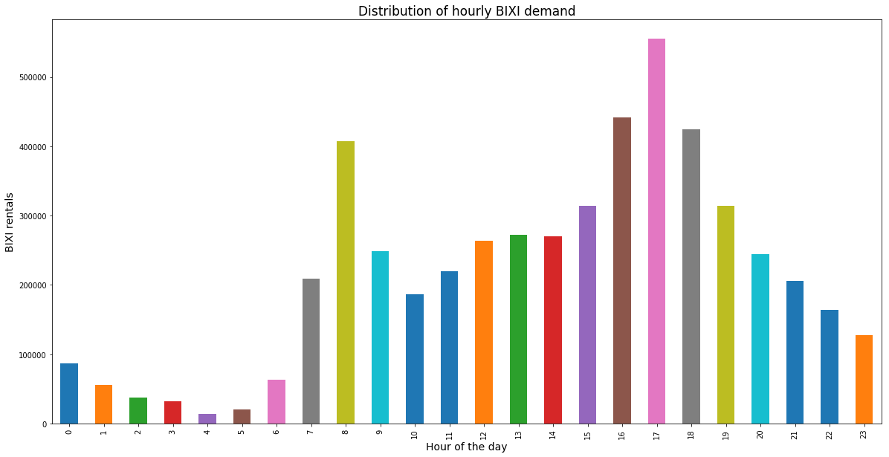

Next, we can see that the usage pattern for different months (4-11 <=> April-November)  vary. In fact, rentals are the highest for May-September and the lowest for colder months and beginning and end of season which corresponds to the months ofApril, October and November.

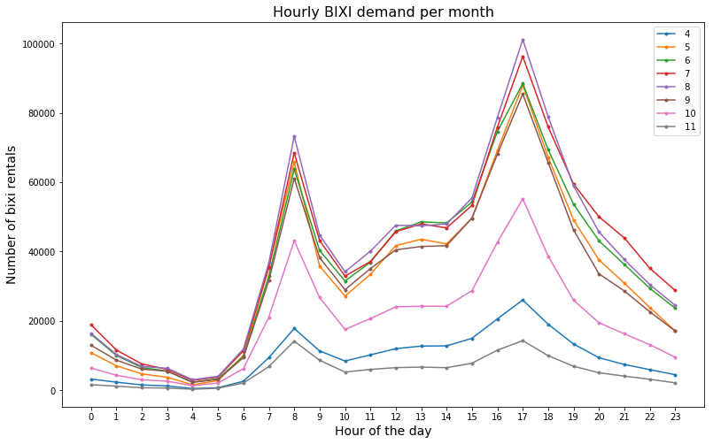

From the heatmap below, we can see how rentals occur during a typical week, from blue (lowest) to red (highest), it is clear that weekends have a different pattern usage as there are no prominent pearks and rentals do not vary as much as week days which makes sense as more people work during the week days and use Bixis to commute. Also, weekends show a higher usage than week days around midnight.

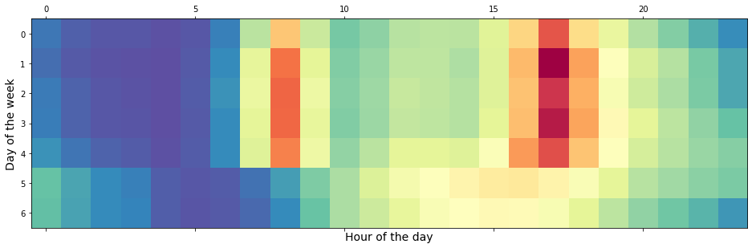

## Correlation Heatmap
- To identify which exogenous variables (X) into SARIMAX, looking at the correlation with bike rentals is useful.
- "Heat index", "feels like", "temp" seem to bring the same information as they are almost perfectly correlated.
- "UV index" and "humidity" are also correlated with the number of rentals.
- Surprisingly, precipitation is not so correlated with bike usage.
- Another interesting fact is that **casual** users' bike usage is slightly more positively correlated with weather features such as temperature, uv_index and whether it has rained or not during their rental than **members**. Because both members and casual users are similarly correlated with weather, there will be no distinction between them for the purpose of forecasting the number of hourly bike rentals.
- To select which regressor(s) to include in SARIMAX, Random Forest and FBprophet algorithms.

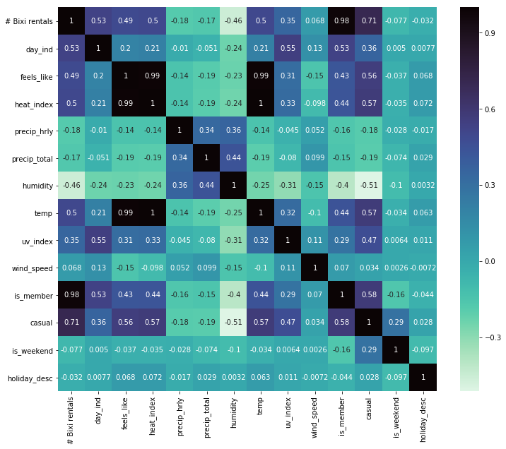

## Missing values for weather

There are missing values for some hours for some days, the prior hour weather description will be used as a proxy as it is the best approximation and all values are necessary to use weather features as exogenous regressors (using Pandas' bfill).

# Part 2 : Modeling
#### Chosen Metrics : RMSE, R2

- **RMSE** will be used as the main metric to choose the best model as it is the most interpretable and can be translated into the average number of bikes the model is off by. It measures the square root of the average sum of squared residuals of the model.
  - RMSE = $\sqrt{\frac{1}{n}\sum_{i=1}^{n}(y_j-\hat{y_j})^{2}}$

- **R2** will be used as a second metric if models show a similar RMSE. R2 measures the variance explained by the model in comparison to the total variance.


### Random Forest Regressor
Contrarily to time series modeling, random forest regression forecasts the number of rented bikes by looking at every hour of the day independently from the past and attempts to explain the target variable with regressors, mainly composed of weather features and extracting information from the timestamp.

To do so, creating features is necessary:
- Extracting hour & month from date to use as features
- Additional feature for clustering months with similar weather (warm vs colder months)
- Additional feature for hours of the day with similar bike usage due to rush hour

```python
# Extracting hour of the day and month from timestamp to use as features
df.date_hour = pd.to_datetime(df.date_hour)
df['hour'] = df.date_hour.dt.hour
df['month'] = df.date_hour.dt.month
df = df.drop(['date_hour'],axis = 1)
```
The data now looks something like this:

<div>
<style scoped>
    .dataframe tbody tr th:only-of-type {
        vertical-align: middle;
    }

    .dataframe tbody tr th {
        vertical-align: top;
    }

    .dataframe thead th {
        text-align: right;
    }
</style>
<table border="1" class="dataframe">
  <thead>
    <tr style="text-align: right;">
      <th></th>
      <th>bixi_rentals</th>
      <th>day_ind</th>
      <th>feels_like</th>
      <th>heat_index</th>
      <th>precip_hrly</th>
      <th>precip_total</th>
      <th>humidity</th>
      <th>temp</th>
      <th>uv_index</th>
      <th>wind_speed</th>
      <th>condition</th>
      <th>is_weekend</th>
      <th>is_holiday</th>
      <th>hour</th>
      <th>month</th>
      <th>season</th>
      <th>rush_hour</th>
    </tr>
  </thead>
  <tbody>
    <tr>
      <th>0</th>
      <td>50</td>
      <td>0.0</td>
      <td>27.0</td>
      <td>32.0</td>
      <td>0.0</td>
      <td>0.0</td>
      <td>83.0</td>
      <td>32.0</td>
      <td>0.0</td>
      <td>6.0</td>
      <td>Fair</td>
      <td>0</td>
      <td>0</td>
      <td>0</td>
      <td>4</td>
      <td>cold_season</td>
      <td>not_rush</td>
    </tr>
    <tr>
      <th>1</th>
      <td>27</td>
      <td>0.0</td>
      <td>26.0</td>
      <td>34.0</td>
      <td>0.0</td>
      <td>0.0</td>
      <td>75.0</td>
      <td>34.0</td>
      <td>0.0</td>
      <td>10.0</td>
      <td>Fair</td>
      <td>0</td>
      <td>0</td>
      <td>1</td>
      <td>4</td>
      <td>cold_season</td>
      <td>not_rush</td>
    </tr>
  </tbody>
</table>
</div>


```python
def create_dummies(col_names, df):
    """
    Function to create dummy variables for all columns mentioned in col_names list for the dataframe df

    :param col_names: list of columns to be converted into dummy variables
    :param df: initial dataframe

    :returns: dataframe with dummy variables for all columns mentioned in col_names list for the dataframe df
    """
    for col in col_names:
        dummy = pd.get_dummies(df[col], prefix = f'{col}')
        df.drop([col], axis = 1 , inplace = True)
        df = pd.concat([df,dummy] , axis = 1)
    return df
```

**Dummy variables** were created for:

- condition: Fair or Windy;
- day_ind: 1 if there is daylight or 0 otherwise;
- month: month of the year, to avoid sense of magnitude, even if month has a logical order;
- hour: hour of the day, to avoid sense of magnitude, even if hour has a logical order;
- is_weekend: 1 is it is the weekend or 0 otherwise;
- is_holiday: 1 is it is the weekend or 0 otherwise;
- season: indicated whether the month is considered to be in the cold season or warmer season
- rush_hour: indicated whether the specified hour is considered rush hour

### Defining regressors and target variable

```python
X_rf = df.drop(['bixi_rentals'], axis = 1)
y_rf = df[['bixi_rentals']].values.ravel()
```
For each model, I create a function that runs a grid search and find optimal parameters which minimize MSE as the RMSE is the metric of choice for this problem.

```python
def grid_search_RFC(X, y, max_depth = [8], max_features = [30], n_estimators = [350]):
    """
    function to grid search random forest regressor and find optimal parameters minimizing MSE

    :param X: predictors in dataframe with each predictor as a column
    :param y: array of predicted values
    :param max_depth: list of maximum depth for each tree (see RF regressor parameters)
    :param max_features: list of number of maximum features (see RF regressor parameters)
    :param n_estimators: list of number of trees in forest (see RF regressor parameters)

    :returns: optimal parameters for random forest regressor minimizing MSE
    """

    param_grid_rf = {'criterion' : ['mse'],  # To minimize variance
                     'max_depth': max_depth,
                     'max_features': max_features ,
                     'n_estimators': n_estimators }  # Number of trees in forest


    rf = RandomForestRegressor() # Instantiating Random Forest regressor
    grid_rf = GridSearchCV(rf, param_grid = param_grid_rf) # default cv = 3
    grid_rf.fit(X, y)

    return grid_rf.best_params_
```

After creating a function that runs a GridSearch for the Random forest regressor, I found that optimal parameters are:


    {'criterion': 'mse', 'max_depth': 8, 'max_features': 30, 'n_estimators': 350}

After fitting and predicting with the optimal model, I validate the results using a function that returns RMSE and R2 scores.

```python
def metrics_RF(X,y,test_size = 1309):

    rf, y_train, y_train_hat, y_test, y_test_hat = fit_predict_RF(X, y, test_size = test_size)

    rmse_train = np.sqrt(mean_squared_error(y_train, y_train_hat))
    R2_train = r2_score(y_train, y_train_hat)

    rmse_test = np.sqrt(mean_squared_error(y_test, y_test_hat))
    R2_test = r2_score(y_test, y_test_hat)

    print (f'RMSE_train: {rmse_train}; R2_train : {R2_train}')
    print (f'RMSE_test: {rmse_test}; R2_test : {R2_test}')
```


```python
rf, y_train, y_train_hat, y_test, y_test_hat = fit_predict_RF(X_rf, y_rf, test_size = 1309)
```
Looking at the RMSE and R2 scores, it is clear than the random forest regressor is overfitting the training set: R2 test is around 0.15 > R2 train, which is high even with precautions to avoid overfitting, such as building shallow trees. More work is still needed to avoid this situation as it is currently fitting random noise present in the data.

    RMSE_train: 232.80255001360123; R2_train : 0.9352170482650859
    RMSE_test: 266.4843818264154; R2_test : 0.7986445519725162

According to  the plot below, the most important features are whether it's rush hour or not, the uv_index and relative humidity. The wind factor doesn't seem to have a significant importance in encouraging bike rentals in the city.

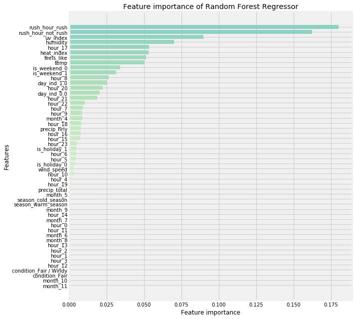


The plot below shows the forecast for a sample of the test period (one week ~ 168 hours). It is clear that:
- There is no clear pattern in the error (in yellow)
- The forecasted number of rentals seems to properly fit the observed values for week days, but seems to show a poor fit for the weekends (September 22, 23 and 29).
- There is also a large error (around 1000) on September 21, the forecast is much higher than the observed values.
- All errors are within 1000, which is great for the overall city at a given hour.


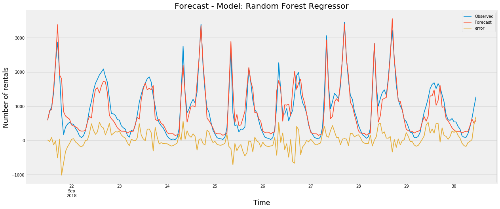


### XGBoost - Boosted trees

Next, XG Boost (boosted trees) is a good choice to obtain a better forecast which minimizes RMSE. After gridsearch,
```python

reg = xgb.XGBRegressor()
param_grid_xg = {'max_depth': [4],
                 'learning_rate' : [0.15],  # After 0.15, performance starts to decrease
                 'gamma' : [3],           # Gamma is for regularizing and avoiding overfitting
                 'n_estimators': [90]}
```
The optimal parameters for XGBoost are :

    {'gamma': 3, 'learning_rate': 0.15, 'max_depth': 4, 'n_estimators': 90}

- Gamma parameter is for regularizing and attempting to reduce overfitting the training set and random error
- Learning rate parameter: After 0.15, performance starts to decreased
- Max depth: Again, to avoid overfitting, shallow trees are prefered.

With XGBoost, the model seems to overfit the training set, even with shallow trees (max_depth = 4). There is still work to be done to include some type of parameterization and penalize overfitting. Although the model overfits the training set, the testing set shows better results than the Random Forest regressor as the difference in RMSE and R2 between Train and Test is much closer.

    RMSE_train: 211.79209138875382; R2_train : 0.946382724285513
    RMSE_test: 228.9684764748469; R2_test : 0.8513478305423114

XGBoost model shows a similar but slightly better fit in comparison to the random forest model:

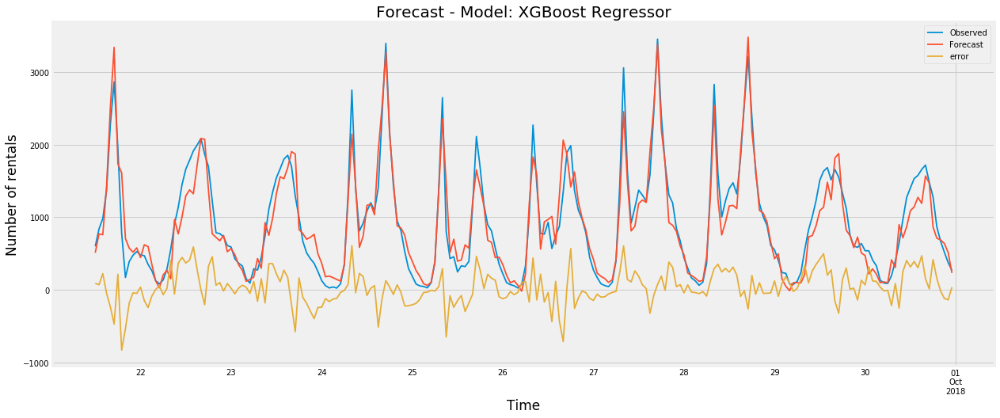

### Time Series analysis with SARIMAX(p,d,q)(P,D,Q)m

SARIMAX(p,d,q)(P,D,Q)m has 7 parameters and is used to model a seasonal time series with seasons that repeat at m frequency

- p: Trend autoregressive order i.e. how many previous lags are used for prediction
- d: Trend difference order i.e. how many times the TS was differenced
- q: Trend moving average order
- P: Seasonal parameter for autoregressive order. The hyperparameter m needs to be fixed before setting P,D,Q. For example, if m is set to 24 hours, then setting P = 1 means that the model will offset 24 periods (m*P) to make a prediction.

-  $t_1 = t_0 * (m*P)$

- D: Seasonal difference order
- Q: Seasonal moving average order
- m: Number of time steps for a season to repeat

First, to use SARIMAX modeling, the time series needs to be stationary, meaning that it should not show any obvious trend or seasonality, and the rolling mean and standard deviation should be constant. It will be done with the following function which runs the Adfuller test, where the null hypothesis is that the time series is not stationary. Therefore if we reject the null hypothesis with a confidence level of choice (95%), we can declare that the time series is in fact stationary.

```python
def stationarity_check(df, window = 24):
    """
    Function to check stationarity of time series by doing the Adfuller test and
    plotting the rolling mean and rolling standard deviation on the specified window.

    :param df: timeseries
    :param window: window for the rolling mean and rolling standard deviation
    """
    rcParams['figure.figsize'] = 18, 8
    rolmean = df.dropna().rolling(window = window).mean()
    rolstd = df.rolling(window = window, center = False).std()

    fig = plt.figure(figsize=(18,8))
    orig = plt.plot(df.dropna(), color='teal',label='Original', alpha = 0.55, linewidth=1)
    mean = plt.plot(rolmean, color='yellow', label='Rolling Mean', linewidth=2.0)
    std = plt.plot(rolstd, color='black', label = 'Rolling Std', linewidth =2.0)

    plt.legend(loc='best')
    plt.title('Rolling Mean & Standard Deviation')
    plt.show(block=False)

    X = df.dropna().values.flatten()
    result = adfuller(X)

    print('ADF Statistic: %f' % result[0])
    print('p-value: %f' % result[1])
    print('Critical Values:')
    for key, value in result[4].items():
        print('\t%s: %.3f' % (key, value))
```

#### Stationarity check

For the time series, the p-value is significantly low and we are over 99% confident that the time series is stationary according to the AD-Fuller test as the ADF statistic is well below the 1% critical value. This tells us that we can forecast using a SARIMAX model.


    ADF Statistic: -5.604657
    p-value: 0.000001
    Critical Values:
    	1%: -3.432
    	5%: -2.862
    	10%: -2.567


#### Shifting the distribution

Because bike usage is seasonal, we would expect that bike usage is similar at the same hour of the day during the week days, but we cannot assume that it is true for the weekend. For that reason, using a weekly seasonality would make more sense, as Monday should show a similar usage (assuming everything similar weather) to the previous Monday and the same applies to weekends.

In terms of hours, forecasting using **m = 168** hours is computationally expensive with SARIMAX and would be too time consuming to optimize the model.

For that reason, shifting the distribution of the time series by exactly one week and substracting it by the original time series allows for more opportunity to tune hyperparameters and for the shifted time series, a period of **m = 24** can be used with SARIMAX.


```python
y_shift = y - y.shift(168) # Shifting by a week worth of hours
y_shift.dropna(inplace = True)
```

#### ADF for shifted time series

The shifted time series is also stationary and the ADF statistic is significantly lower than the 1% critical value. We can reject the null hypothesis that the time series is stationary in favor of the alternative hypothesis. There is no need for differencing to achieve stationarity, therefore **d = 0**.

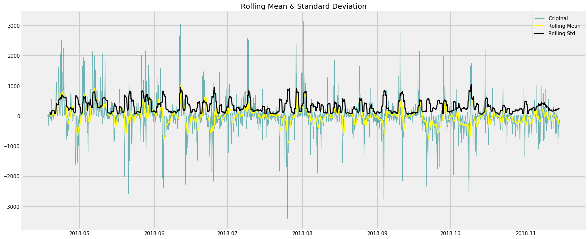


    ADF Statistic: -9.144427
    p-value: 0.000000
    Critical Values:
    	1%: -3.432
    	5%: -2.862
    	10%: -2.567

#### ACF & PACF plots

From the plots below, we are able to set initial parameters p, q and P, Q.

- **PACF**: Autoregressive component

There are many instances where the correlation with previous lags is above the confidence band, but the first lag seems to be the most correlated. To avoid complexity, **p = 1** for the AR non-seasonal component. The spike at lag 168 suggests that **P = 1** for the AR seasonal component.


- **ACF**: Moving average

The ACF plot shows that lags 1 and 2 have significant spikes although lags up to 32 are outside of the confidence band. For now, **q = 2** for the non-seasonal AR component. The spike at lag 168 shows that **Q = 1** for the seasonal component of MA.

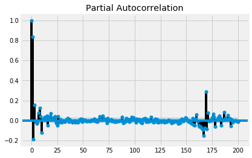


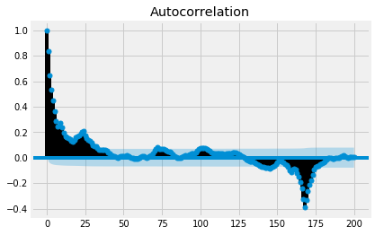

#### BaseModel : SARIMAX(1,0,2)(1,0,1)24


#### GridSearch for optimal SARIMAX parameters

```python
# def grid_search_SARIMAX(endog = y_train, exog = X_train):

#     p = [1]
#     d = [0]
#     q = [2] # values to try: list(range(1,3))
#     P = [2] # values to try: list(range(1,4))
#     D = [0]
#     Q = [2,3] # values to try: list(range(1,4))
#     pdq = list(itertools.product(p, d, q))
#     PDQ = list(itertools.product(p, d, q))
#     seasonal_pdq = [(x[0], x[1], x[2], 24) for x in list(itertools.product(P, D, Q))]

#     gridsearch = {'parameters':[], 'AIC': []}

#     for param in pdq:
#         for param_seasonal in seasonal_pdq:
#             gridsearch['parameters'].append(f'{param}x{param_seasonal}')
#             try:
#                 mod = sm.tsa.statespace.SARIMAX(endog= endog,
#                                                 exog= exog,
#                                                 order=param,
#                                                 seasonal_order=param_seasonal,
#                                                 enforce_stationarity=False,
#                                                 enforce_invertibility=False)

#                 results = mod.fit(maxiter = 200)

#                 gridsearch['AIC'].append(results.aic)
#             except:
#                 continue
#     return pd.DataFrame(gridsearch)
```

From the correlogram plot below (bottom right):

- Residuals seem to have low correlation with lagged residuals. There is still some correlation that is not captured by the model and the residuals are not fully random.  
- The ACF plot of the residuals shows that **not** all autocorrelations are within the threshold limits, indicating that the residuals are not behaving like white noise and there is still autocorellation with previous lags'residuals.

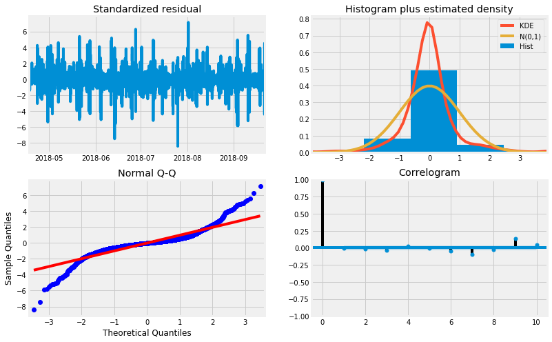


#### Forecast with optimal SARIMAX (1, 0, 2)x(2, 0, 3, 24)

#####  Predictions  and Metrics

To get the RMSE score and R2 scores, it makes sense to compare the observed values to the forecasted rentals. So, adding back the shifted distribution we had substracted initially, the obtained results are:

    The training RMSE is 251.75915635775618
    Training R2 score is 0.9271783999962496
    The test RMSE is 372.53262824419653
    Test R2 score is 0.7520641252147787

##### Visualising results

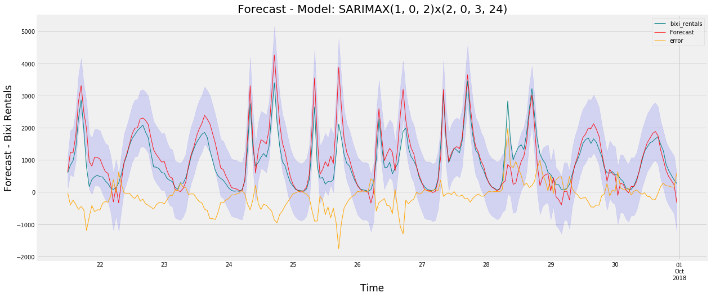

##### Conclusion for SARIMAX:

The next step will be to model the timeseries using FBProphet as it allows for more flexibility in modeling and is less time consuming to tune hyperparameters. The optimal model was selected by grid searching different combinations of parameters for p,q,P,Q which minimized the AIC score.

The Akaike information criterion (AIC) estimates the relative amount of information lost by a given model, the less information a model loses, the higher the quality of that model.

The training set seems to be overfitted and the current model and doesn't generalize too well. There is a significant difference between the R2 score obtained for the training set in comparison to the test set.

More data could be added to increase the training set's size to reduce the RMSE and increase R2.

It will not be optimized further.

### FB Prophet

Contrarily to the SARIMAX model, FBProphet is framed as a "curve-fitting" problem rather than a time-dependency problem. It is an additive regression model.

The model uses time as a regressor instead of the time-dependence of each value within the time-series.

With FB Prophet, it is possible to have multiple seasonalities, for daily and weekly in this case. Each seasonality component is estimated using a tunable parameter for the Fourier order. Increasing the Fourier order allows for additional waves into the model, meaning that the seasonality curve is allowed to change more quickly.

For each timestamp (t), the model predicts a value y(t) represented by the sum of the trend component g(t), the seasonality s(t) component that accounts for periodic changes (daily & weekly for Bixi), a holiday h(t) component plus an error term which is assumed to be normally distributed.

- $y(t) = g(t) + s(t) + h(t) + \epsilon_t$

The model I used includes exogenous variables as well to explain variability.

- $y(t) = g(t) + s(t) + h(t) + \beta * X + \epsilon_t$

```python
def fit_predict(ts_fb,train_obs, daily_seasonality = 25,weekly_seasonality = 170,include_history = False,c = 0.001):

    """   
    Takes in dataframe with columns ds, y for target variable, eXogenous variables as first argument (ts_fb)
    and  as second argument (train_obs). Returns model (m) and forecast using
    the rest of the observations to test.

    :param ts_fb: dataframe with columns ds, y containting target variables, eXogenous variables
    :param train_obs: number of training observations
    :param daily_seasonality: order of daily seasonality
    :param weekly_seasonality: order of weekly seasonality
    :param include_history: if set to true, predicts all values; if set to false, trains and test
    :param c: number of training observations

    :returns: model and dataframe with forecast using the out of sample observations for testing
    """    
    m = Prophet(growth='logistic',
                yearly_seasonality=False,
                daily_seasonality = daily_seasonality,          
                weekly_seasonality = weekly_seasonality,
                interval_width=0.95,
                changepoint_prior_scale= c)   # change_prior_scale decreased to make the trend less flexible

    m.add_regressor('heat_index')
    m.add_regressor('precip_total')
    m.add_regressor('humidity')
    m.add_regressor('wind_speed')
    m.add_country_holidays(country_name='Canada')

    # Setting minimum possible value to 0
    ts_fb['floor'] = 0  
    ts_fb['cap'] = ts_fb.y.max()

    # Train model up to train_obs' index
    m.fit(ts_fb[:train_obs])  


    future = m.make_future_dataframe(periods=(ts_fb.shape[0] - train_obs),
                                     freq = 'H',
                                     include_history = include_history)

    if train_obs <= 1:
        return "train_obs parameter should be above 1, choose an appropriate number of observations for training"

    elif include_history == False:

        # forecast will return prediction for test set with exogenous variables

        # Adding Exogenous variables to future dataframe needed to predict y
        future['heat_index'] = ts_fb.heat_index[train_obs:].reset_index().drop(['index'],axis = 1)
        future['precip_total'] = ts_fb.precip_total[train_obs:].reset_index().drop(['index'],axis = 1)
        future['humidity'] = ts_fb.humidity[train_obs:].reset_index().drop(['index'],axis = 1)
        future['wind_speed'] = ts_fb.wind_speed[train_obs:].reset_index().drop(['index'],axis = 1)
        future['floor'] = 0
        future['cap'] = ts_fb['cap']
        # Test model starting at last observation from train_obs
        forecast = m.predict(future)

    else:
        # forecast will return prediction for training set with exogenous variables      

        forecast = m.predict(ts_fb[:train_obs])

    return m, forecast
```
The best model so far seems to overfit the training set as it seems to learn the noise rather than the signal.

    RMSE Train: 317.9860921087208 ; R2 Train: 0.8622000863339121
    RMSE Test: 404.55415032367307 ; R2 Test: 0.7213622495432284

#### HyperParameter Tuning

- Change_point_prior_scale
- Daily Seasonality Fourier Order
- Weekly Seasonality Fourier Order

**Tuning Fourier Order**

- Increasing the Fourier order allows for a lesser smooth curve fit, meaning that the model is allowed to fit at a higher frequency.

##### Visualizing results

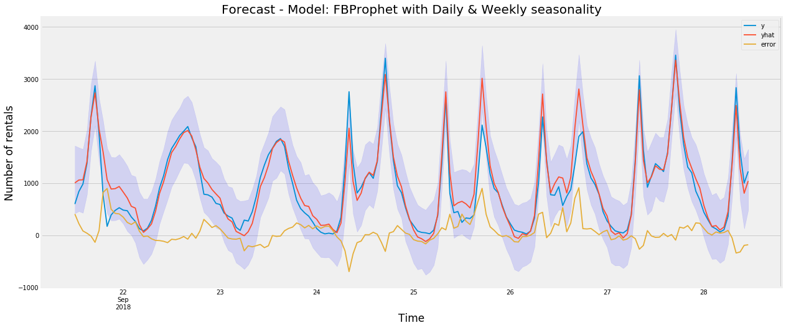

### Model Stacking

To stack the 4 models, fitting a linear regression to predict training set's observed values using the 4 model predictions as the as regressors will give return coefficients to use in a weighted average to obtain a final stacked the model. After fitting the linear regression, the weights used in the final model are:

    RandomForestRegressor: 0.2955404138782251
    XGBoost: 0.6192844978845874
    SARIMAX: 0.08572847844921101
    FB_Prophet: 0.12688710988303


Results for  Stacked Model

- RMSE Train:  209.47700771594825; R2 Train = 0.9449797468528242
- RMSE Test:  251.3329945447773; R2 Test = 0.8589717223585884

## Next steps

- To improve the hourly forecast, it would be interesting to look at:
 - Linear Regression
 - Deep Learning with LSTM because of weather or event in the city that will hike up the demand
- There is still room for improvement as most models are overfitting the training set and are at risk of generalizing poorly to the testing period.
- I am interested in looking at rebalancing docking stations and have requested data directly from the Bixi team, which they have recenlty shared.
